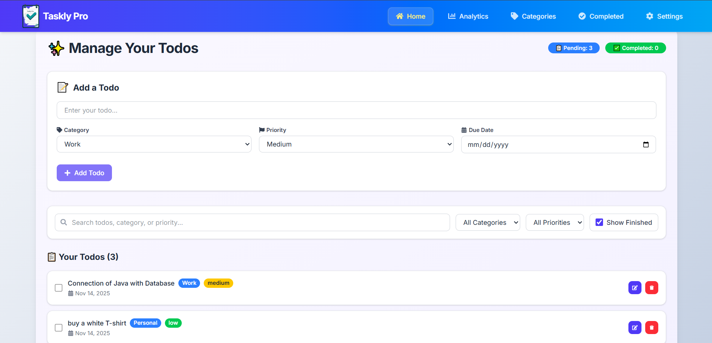
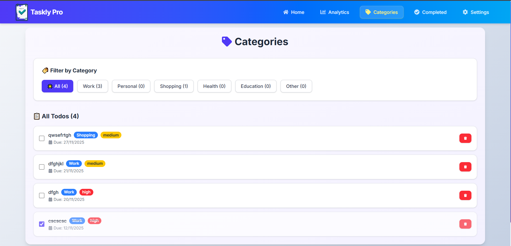
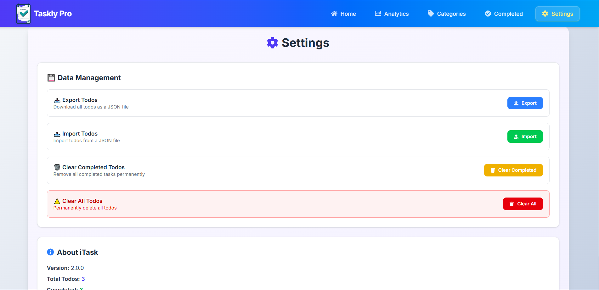

# 📝 Taskly Pro – Your Smart Task Planner
Hi! My name is Garvit Dani, I created Taskly Pro to help you manage, organize, and plan your daily tasks efficiently — making productivity simple, focused, and visually engaging.


> A modern and responsive **Todo List & Task Planner App** built with **React (Vite)** and **Tailwind CSS**.  
> Manage your daily goals, organize by category and priority, set due dates, and track productivity — all with a clean, minimal interface.

---

##  Features

-  Add, edit, delete, and complete todos effortlessly  
-  Organize tasks by **categories** like Work, Personal, Health, etc.  
-  Filter and **search by category, priority, or task name**  
-  Set **due dates** and automatically highlight **overdue tasks**  
-  Built-in **Analytics Dashboard** for insights on productivity  
-  Manage data with import/export and clear-all options  
-  Persistent data using **localStorage**  
-  Beautiful, responsive **light-themed UI** built with Tailwind CSS  

---

##  Screenshots

###  Home Page  
Manage all your tasks, filter, search, and mark completion.  

###  Analytics Dashboard  
Visual breakdown of tasks by category, priority, and completion status.  

analytics-page
###  Categories Page  
View and manage tasks grouped by their categories.  


###  Completed Tasks  
View and reopen previously completed tasks easily.  


###  Settings Page  
Import/export data, clear completed or all todos, and manage preferences.  


---

##  Tech Stack

| Technology | Description |
|-------------|-------------|
|  React (Vite) | Frontend framework for fast, modular development |
|  Tailwind CSS | Modern utility-first CSS for styling |
|  date-fns | Date formatting and due date calculation |
|  LocalStorage | Persistent data storage on client side |
|  React Icons | Modern, lightweight icon library |

---

##  Installation & Setup

Clone the repository and run locally:

```bash
# Clone this repository
git clone https://github.com/Garvit-developer/Taskly_Pro.git

# Go into the project folder
cd Taskly_Pro

# Install dependencies
npm install

# Run development server
npm run dev
